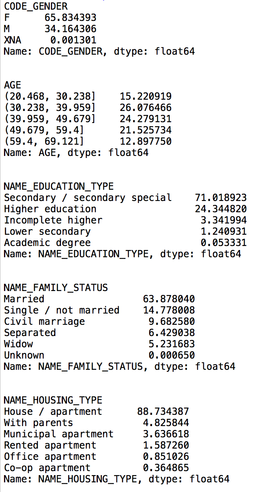

### Machine Learning I Project

**Who will default on a loan?**

For my final project for my Machine Learning I class, my group and I used data from a microlender called Home Credit (from a Kaggle competition) to predict whether a client would default on a loan. Home Credit operates in several counties including countries in Europe, Asia, and some parts of the United States. It focuses on lending to those that are unbanked and provides access to credit for people with little to no credit. 

This document will cover some of the challenges of this particular problem and will show how some different machine learning algorithms work on this problem. 

**The data** 

The dataset includes several features including loan type, demographic information about the client, annual income of the client, and the outcome--whether the client defaulted or not. Below is code to import numpy and pandas and read in the data. 

```
import numpy as np
import pandas as pd

df = pd.read_csv("application_train.csv)
```
A data dictionary was provided with the code, so I want to give some summary statistics for demographic information about the clients in the dataset. I need to a do a little bit of cleaning first since the age variable (DAYS_BIRTH) is given as the number of days ago from the date of application that the respondent was born. This is a negative number, so I just divide by 365 and change the sign to get the number of years. I also initialize a vector of demographic variable I'm interested in to throw in a loop and see the percentage of the sample for each. 

```
df['AGE'] = -df['DAYS_BIRTH']/365
demographic_variables = ['CODE_GENDER', 'AGE','NAME_EDUCATION_TYPE', 
                         'NAME_INCOME_TYPE', 'NAME_FAMILY_STATUS',
                         'NAME_HOUSING_TYPE']
                         

for i in demographic_variables:
    if i != 'AGE':
        print(i)
        print(df[i].value_counts(normalize=True)*100)
        print('\n')
        
    elif i == 'AGE':
        df.sort_values(by=[i])
        print(i)
        print(df[i].value_counts(normalize=True, bins = 5).sort_index()*100)
        print('\n')
```



